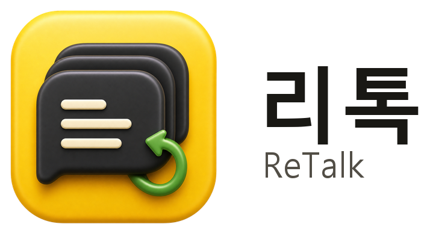
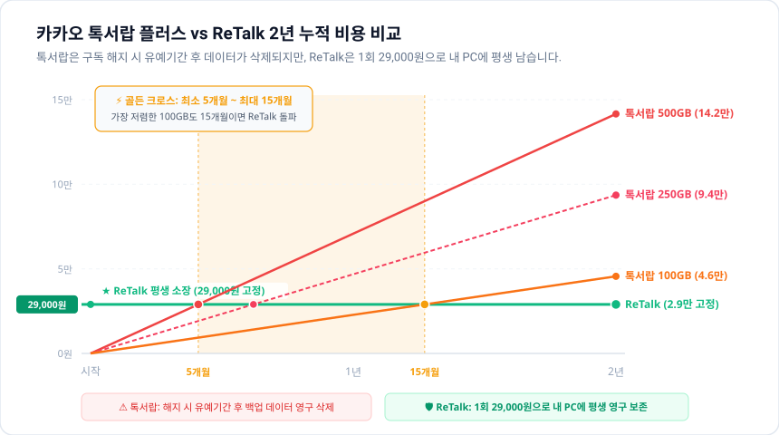

# ReTalk (리톡) — PC 카카오톡 대화 복원 & 내 컴퓨터 평생 보관 도구

  <picture>
    <source media="(prefers-color-scheme: dark)" srcset="./assets/retalk-logo-dark.png">
    <source media="(prefers-color-scheme: light)" srcset="./assets/retalk-logo-light.png">
    
  </picture>

  <strong>"카카오톡은 흘려보내는 플랫폼이고, 내 대화의 주인은 나입니다."</strong> 
  매달 나가는 구독료 없이, 내 삶의 대화와 사진을 내 컴퓨터에 평생 보관하고 
  내 개인 AI(ChatGPT, Gemini, Claude)가 안전하게 내 대화를 읽을 수 있도록 연결합니다.

  
  
  
  

---

## 💡 왜 ReTalk이 필요한가요?

### 1. 내 대화의 주체성 (My Data, My Agency)
가족, 친구, 동료와 나눈 대화와 소중한 사진은 온전히 나의 것입니다.  
사진은 때가 지나면 다운로드할 수 없게 되고, 스마트폰을 교체할 때 미리 챙기지 못하면 과거 대화는 쉽게 사라집니다.  
ReTalk은 외부 클라우드 구독에 얽매이지 않고, 내 컴퓨터 안에 내가 직접 소유하는 평생 사본을 만듭니다.

### 2. AI가 내 카톡 대화를 읽고 기억하도록 연결
최신 AI(ChatGPT, Gemini, Claude)에게 내 과거 일상이나 업무 내용을 물어보고 싶어도, 카카오톡의 닫힌 저장소 안에는 접근할 수 없습니다.  
ReTalk은 내 PC에 보관된 대화를 로컬 AI 연동(MCP)으로 연결하여, 내 개인 AI가 안전하게 내 지난 대화를 검색하고 답변할 수 있게 돕습니다:
- *"지난달 팀장님이 공유해 준 참고 링크 찾아줘"*
- *"작년에 거래처와 합의했던 단가 조건이 뭐였지?"*
- *"내가 언제 누구랑 약속 잡았더라?"*

대화 내용이 외부 서버로 전송되지 않고, 100% 내 PC 안에서 안전하게 처리됩니다.

---

## 📌 이런 분들에게 꼭 필요합니다

- **PC 카톡의 사진 미저장 한계**: PC 카카오톡은 텍스트만 기록하며, 사진이나 영상은 따로 저장해두지 않으면 기간 만료로 사라집니다. ReTalk을 켜두면 만료 전에 사진과 동영상을 내 PC 폴더로 실시간 자동 보관합니다.
- **폰 바꾸며 대화가 날아갔을 때**: 평소 PC 카카오톡을 로그인해 써왔다면, 스마트폰 백업이 없어도 컴퓨터에 남아 있는 과거 대화를 복원할 수 있습니다.
- **매달 나가는 구독료가 부담될 때**: 사진을 보관하기 위해 카카오 톡서랍에 매달 돈을 낼 필요 없이, 1회 구매로 내 컴퓨터에 평생 소장합니다.
- **분쟁이나 법원 자료 준비 시**: 단순 캡처는 조작 시비가 생기기 쉽습니다. 해시값과 무결성 기록이 포함된 검증 패키지를 만듭니다.

---

## 📈 톡서랍 플러스 vs ReTalk 비용 비교

> ⚠️ 카카오 톡서랍은 매달 구독료를 내야 하며, **구독 해지 시 일정 유예 기간이 지나면 모든 백업 데이터가 영구 삭제**됩니다.  
> 반면 **ReTalk은 단 1회 ₩29,000원(Archive)으로 내 컴퓨터에 평생 소장**되어 추가 지출이 0원입니다.

  <picture>
    <source media="(prefers-color-scheme: dark)" srcset="./assets/cost-comparison-chart-dark.svg">
    <source media="(prefers-color-scheme: light)" srcset="./assets/cost-comparison-chart-light.svg">
    
  </picture>

| 구분 | 톡서랍 100GB (월 1,900원) | 톡서랍 250GB (월 3,900원) | 톡서랍 500GB (월 5,900원) | **ReTalk Archive (1회 평생 소장)** |
|:---:|:---:|:---:|:---:|:---:|
| **6개월** | 11,400원 | 23,400원 | 35,400원 (돌파) | **₩29,000** |
| **골든 크로스** | **15개월 차 돌파** | **7개월 차 돌파** | **5개월 차 돌파** | **추가 비용 0원 (고정)** |
| **1년 (12개월)** | 22,800원 | 46,800원 | 70,800원 | **₩29,000** |
| **2년 (24개월)** | 45,600원 | 93,600원 | 141,600원 | **₩29,000** |
| **해지 시 데이터** | 유예기간 후 영구 삭제 | 유예기간 후 영구 삭제 | 유예기간 후 영구 삭제 | **내 컴퓨터에 평생 보관** |

- **골든 크로스(최소 5개월 ~ 최대 15개월)**: 가장 저렴한 100GB 요금제도 15개월이면 ReTalk 1회 비용을 넘어서며, 250GB 및 500GB 요금제는 단 5개월에서 7개월 만에 ReTalk보다 비싸집니다.
- 무엇보다 ReTalk은 **내 컴퓨터 디스크에 직접 저장**되므로, 구독을 중단한다고 해서 데이터가 사라지지 않습니다.

---

## ⚡ 핵심 기능

1. **복원 가능 대화 무료 선확인 (0원)**: 결제 전 내 컴퓨터에서 복원 가능한 대화방과 메시지 건수, 최근 대화를 눈으로 직접 무료 확인합니다.
2. **만료 전 사진·영상 실시간 자동 보관 (Archive)**: PC 카톡 실행 중 오가는 사진, 동영상, 문서를 감지하여 기간 만료 전에 내 PC로 안전하게 저장합니다.
3. **대화 검색 & 파일 내보내기 (Archive)**: 날짜·참여자·키워드로 과거 대화를 검색하고, HTML(오프라인 뷰어), CSV, PDF, TXT, ZIP으로 영구 보관합니다.
4. **로컬 AI 연동 (Pro: MCP)**: ChatGPT, Gemini, Claude 등 내 개인 AI가 내 대화를 안전하게 읽고 답변할 수 있게 연결합니다. (선택한 채팅방만 접근 허용)
5. **대화 기록 검증 리포트 (Pro)**: 법원 제출이나 분쟁 상담 시 제3자가 파일 무결성을 재검증할 수 있는 해시 기반 증거 패키지를 생성합니다.

---

## 💳 요금제 안내

매달 나가는 구독료가 없는 **1회 결제 평생 라이선스**입니다. (프로필 1개 기준)

| 플랜 | 가격 | 포함 내용 |
|:---:|:---:|---|
| **Free Preview** | **0원** | PC 로컬 데이터 스캔, 복원 가능 분량 확인, 최근 대화 미리보기 |
| **Archive** | **29,000원** | 만료 전 사진·영상 실시간 자동 보관, 과거 대화 전체 열람/검색, HTML·CSV·PDF 내보내기 |
| **Pro** | **49,000원** | Archive 전체 기능 + 로컬 AI 연동(MCP) + 대화 기록 검증 리포트(포렌식 패키지) |

> 💡 `Archive` 플랜을 쓰시다가 AI 연동이나 검증 리포트가 필요해지면, 언제든 **차액 20,000원**만 결제하여 `Pro`로 업그레이드할 수 있습니다.

---

## 🔒 100% 로컬 프라이버시

- **외부 서버 전송 0건**: 대화 본문, 사진, 영상, 연락처는 외부 서버로 1바이트도 전송되지 않으며 오직 내 컴퓨터 안에서만 처리됩니다.
- **비밀번호 불필요**: 카카오톡 비밀번호를 요구하지 않습니다.
- **안내**: ReTalk은 (주)카카오와 제휴 관계가 없는 서드파티 독립 유틸리티 소프트웨어입니다.
- **기술 및 법적 한계**: PC 카카오톡이 사용된 적이 없거나 디스크에서 영구 소멸된 데이터는 복원할 수 없습니다. 검증 리포트는 기술적 무결성 자료이며 공인 감정서가 아니므로 법원의 채택 여부는 해당 사건의 판단에 따릅니다.

---

## 🔗 공식 링크

- 🌐 **공식 웹사이트 및 다운로드**: [https://retalk.agentryx-ai.com/](https://retalk.agentryx-ai.com/)
- 📖 **사용자 가이드**: [https://retalk.agentryx-ai.com/guide/](https://retalk.agentryx-ai.com/guide/)
- 🛡️ **개인정보처리방침**: [https://retalk.agentryx-ai.com/privacy](https://retalk.agentryx-ai.com/privacy)
- 🐛 **문의 및 제안**: [GitHub Issues](https://github.com/Agentryx-ai/ReTalk-Desktop/issues)

  © 2026 Agentryx AI. All rights reserved.

